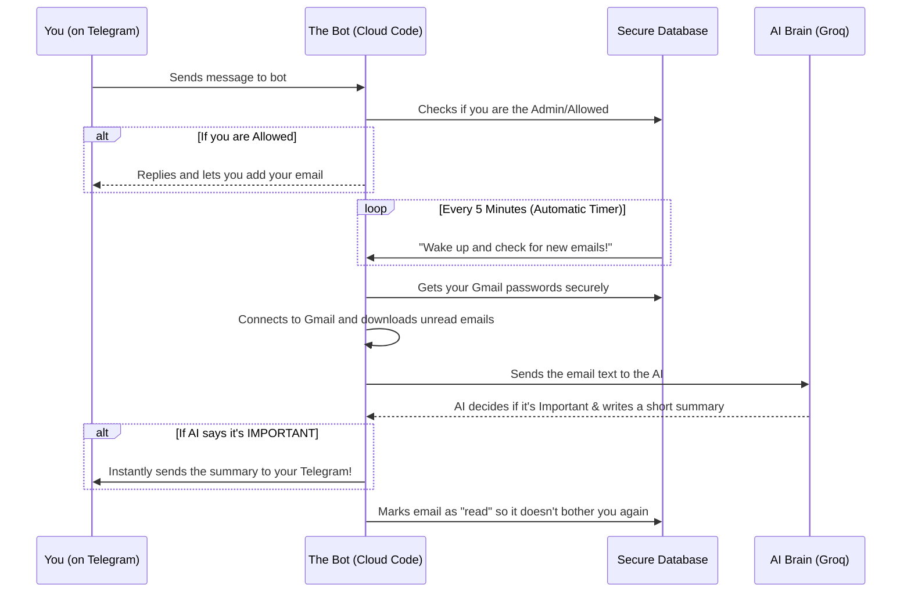
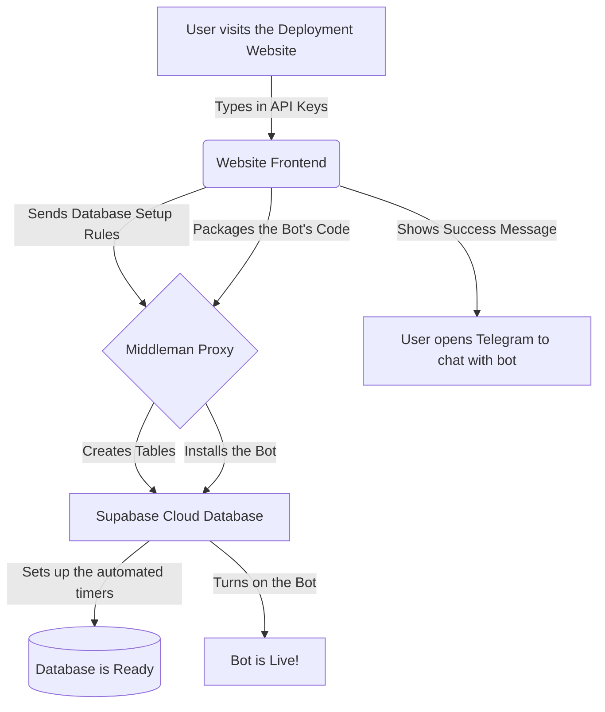

# Email_To_Telebot: System Architecture & Prompt Documentation

## 1. The Problem
In the modern digital age, managing multiple email accounts is overwhelming. Native email clients lump critical correspondence (work deadlines, personal finance, important contacts) together with promotional spam, newsletters, and automated security alerts. Because users rarely open email applications proactively—unlike instant messengers such as WhatsApp or Telegram—important notifications frequently go unnoticed or get buried. Additionally, having 5+ email accounts logged into a mobile device severely degrades the reliability of native push notifications.

## 2. The Solution
**Email_To_Telebot** is a privacy-first, serverless personal assistant. Instead of relying on native email apps, this system actively monitors connected Gmail inboxes, utilizes Artificial Intelligence to instantly classify incoming emails as "Important" or "Routine", and generates concise, 2-bullet point summaries for critical messages. These summaries are immediately pushed to the user's Telegram app, integrating email management into a high-engagement messaging platform. 

The system also includes a **Web Deployment Wizard** that allows users to deploy their own entirely private, self-hosted version of the infrastructure in one click, without needing terminal access or a CLI.

## 3. Technology Stack & Rationale

| Technology | Role | Why It Was Chosen |
|---|---|---|
| **Supabase (PostgreSQL)** | Primary Database | Provides built-in features like `pg_cron` for background cleanup jobs and `Supabase Vault` for military-grade encryption of user App Passwords. |
| **Supabase Edge Functions (Deno)** | Backend Compute | A serverless architecture means **zero idle cost**. The function only spins up when a webhook is triggered by Telegram, making it infinitely scalable and virtually free to run. |
| **Groq API (Llama 3 8B)** | AI Engine | Groq's specialized hardware (LPUs) delivers response times in milliseconds, ensuring that email summaries are pushed to Telegram instantly. The Llama 3 8B model is highly capable of JSON-enforced NLP classification. |
| **React + Vite** | Web Deployment Wizard | Enables the creation of a static, fast client-side web application hosted for free on GitHub Pages. Allows users to authenticate and deploy cloud infrastructure via APIs directly from the browser. |
| **Cloudflare Workers** | API Proxy | Bypasses strict CORS policies on the Supabase Management API by acting as an intermediary edge-proxy for the React deployment application. |

---

## 4. Architecture Diagrams

### A. Core System Workflow

### B. Web Deployment Wizard Flow

---

## 5. Master Prompt (AI Generation Prompt)

*This is an exhaustive, extremely detailed prompt. If you feed this into an advanced LLM (like Claude 3.5 Sonnet or ChatGPT-4o), it will have the exact blueprint to recreate the entire codebase from scratch without any missing context.*

> **System Role:** You are a Principal Cloud Architect and Senior Full-Stack Engineer specializing in Serverless architectures, Supabase, Deno, and React.
>
> **Task:** Build "Email_To_Telebot"—a completely serverless, highly secure Telegram bot that monitors multiple Gmail inboxes, uses AI (Groq Llama 3) to summarize important emails, and features a "One-Click Deploy" React web wizard that automates cloud infrastructure provisioning.
>
> **You must implement the system according to the following exhaustive specifications:**
>
> ### Phase 1: Database Architecture (Supabase PostgreSQL)
> Create a comprehensive SQL migration that initializes the following:
> 1. **Extensions:** Enable `pgcrypto`, `supabase_vault` (schema `vault`), `pg_cron`, and `pg_net`.
> 2. **Tables:**
>    - `users`: `telegram_id` (PK), `first_name`, `username`, `is_admin` (BOOLEAN), `is_approved` (BOOLEAN).
>    - `email_accounts`: `id` (UUID), `user_telegram_id` (FK), `email_address`, `app_password_secret_id` (UUID FK to `vault.secrets`), `is_active`.
>    - `processed_emails`: `id`, `message_id`, `account_id` (FK), `subject`, `sender`, `summary` (TEXT), `processed_at`. (Unique constraint on `message_id` + `account_id` to prevent duplicates).
>    - `user_preferences`: `user_telegram_id` (PK), `snooze_until` (TIMESTAMPTZ), `pending_action` (JSONB for stateful Telegram flows like `/add_email`).
>    - `vip_list` and `blocklist`: `user_telegram_id` (FK), `sender_email`.
> 3. **Vault Integration:** Create a PL/pgSQL function (RPC) named `vault_create_secret(secret text, name text)` that securely inserts a user's Gmail App Password into `vault.secrets` and returns the `secret_id`.
> 4. **Automated Jobs (pg_cron):** 
>    - Create a cron job running every 5 minutes that uses `pg_net` to trigger the Supabase Edge Function to poll emails.
>    - Create a daily cron job running at midnight that executes `DELETE FROM public.processed_emails WHERE processed_at < NOW() - INTERVAL '10 days'` to enforce strict storage lifecycle management. (Wrap `cron.unschedule` in a `DO $$ BEGIN ... EXCEPTION WHEN OTHERS THEN END $$;` block to prevent permission errors).
>
> ### Phase 2: Edge Function Logic (Deno / TypeScript)
> Build a single Edge Function (`email-bot`) acting as the Telegram Webhook and Email Poller. It must contain the following modules:
> 1. **Webhook Handler (`webhookHandler.ts`):** 
>    - **Admin Bootstrap:** Upon receiving `/start`, check the total user count. If 0, upsert user with `is_admin=true, is_approved=true`. Otherwise, upsert with `false`.
>    - **Access Control:** If `is_approved=false`, forward a notification to the Admin (using `is_admin=true`) with interactive `[Approve]` and `[Deny]` inline buttons. Only allow approved users to use commands.
>    - **Stateful Flows:** Implement a multi-step `/add_email` flow. Ask for email -> wait for input -> ask for App Password -> wait for input -> securely execute `vault_create_secret` RPC and save the ID. Store state in `user_preferences.pending_action`.
>    - **Interactive Inline Buttons:** Implement callback queries for `approve:`, `deny:`, `blk:<email>`, `vip:<email>`, and `s1h:` (snooze 1 hour).
> 2. **Email Poller (`emailPoller.ts`):**
>    - Triggered by `pg_cron`. Fetch all active `email_accounts`. For each, decrypt the App Password using `supabase.from('vault.decrypted_secrets')`.
>    - Connect via IMAP (using a Deno-compatible imap library like `imap-simple` or raw socket handling) and fetch UNSEEN emails from the last 24 hours.
>    - Check `vip_list` (bypass AI, push immediately) and `blocklist` (silently log, ignore).
> 3. **AI Classification (`aiService.ts`):**
>    - Pass the subject and body to the Groq API (`llama3-8b-8192`). 
>    - Use a strict JSON prompt instructing the AI to classify as "IMPORTANT" or "ROUTINE", and output exactly 2 bullet points if important.
>    - Implement highly resilient JSON parsing (using regex to strip markdown hallucinated backticks). If parsing fails or API errors occur, fallback to a string: `"⚠️ AI Analysis failed"` instead of returning `null` so the `/digest` command doesn't filter it out.
>
> ### Phase 3: The Web Deployment Wizard (React + Vite)
> Build a UI that allows non-technical users to completely provision this architecture on their own Supabase account without a CLI.
> 1. **CORS Proxy:** All API requests to the Supabase Management API must be routed through a Cloudflare Worker proxy (`https://supabase-management-proxy.rahul-pamula.workers.dev`) to bypass browser CORS restrictions.
> 2. **Database Provisioning:** The React app dynamically imports the raw SQL migration files (schema, pg_net, admin approval, cron jobs) and executes them sequentially via a POST request to the `/v1/projects/{ref}/database/query` endpoint.
> 3. **Edge Function Bundling & Deployment:** 
>    - The web client must dynamically bundle the Edge Function TypeScript files into a single artifact using an in-browser bundler or pre-packaged Blob.
>    - Deploy the function via a `multipart/form-data` POST request to the `/v1/projects/{ref}/functions/deploy` endpoint.
>    - **CRITICAL:** Because Telegram doesn't send Supabase JWT tokens, the deployment wizard must immediately fire a secondary `PATCH` request to `/v1/projects/{ref}/functions/email-bot` setting `verify_jwt: false` to allow public webhook access.
> 4. **Success Screen:** Instruct the user to open Telegram and search for their specific Bot Name to send `/start`.
>
> **Deliverables:**
> Produce the raw SQL migration files, the complete modular Deno Edge Function code, the React Deployment Wizard logic, and instructions on setting up the Cloudflare Worker.
